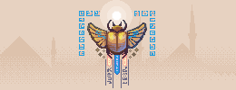

<picture class="full pixels">
    <source srcset="assets/splash-dark.png" media="(prefers-color-scheme: dark)">
    
</picture>

# Cairo 2D Graphics Library

Cairo is a 2D graphics library with support for multiple output devices. Currently supported [output targets](#cairo-backends) include the X Window System (via both [Xlib](./Xlib/) and XCB), Quartz, Win32, image buffers, PostScript, PDF, and SVG file output.

Cairo is designed to produce consistent output on all output media while taking advantage of display hardware acceleration when available (e.g., through the X Render Extension).

The [cairo API](/manual/) provides operations similar to the drawing operators of PostScript and PDF. Operations in cairo include stroking and filling cubic Bézier splines, transforming and compositing translucent images, and antialiased text rendering. All drawing operations can be transformed by any affine transformation (scale, rotation, shear, etc.).

Cairo is implemented as a library written in the C programming language, but [bindings](./bindings/) are available for several different programming languages.

Cairo is [free software](http://www.fsf.org/licensing/essays/free-sw.html) and is available to be redistributed and/or modified under the terms of either the GNU Lesser General Public License (LGPL) version 2.1 or the Mozilla Public License (MPL) version 1.1 at your option.

<a href="news/"><picture class="pixels">
    <source srcset="assets/news-dark.png" media="(prefers-color-scheme: dark)">
    
</picture></a>

- [News](news/). Release notes & other news.
- [Frequently asked questions](faq/): Save yourself some time by reading this early.
- [Tutorial](tutorial/): A one-of-a-kind introduction to the cairo concepts and models.
 
## Cairo Documentation and Off-site Material

Documentation for Cairo is an area that could always be greatly improved. Contributions are very welcome!

<!--

- [API reference manual](/manual/): Function-by-function reference.
- [Cookbook](../cookbook/): Simple recipes for drawing.
- [Samples](../samples/): Some samples of how to use Cairo.
- [Cairoglyphics](../cairoglyphics/): A tutorial by way of diagrams. From a Python POV. Please help debug them.
- [Using the PostScript surface](./using_the_postscript_surface/): How to use the PostScript surface.

Other information that might be of interest:

- [Roadmap](../roadmap/): Features planned for upcoming releases.
- [Todo](../todo/): Other ideas (not yet on the [roadmap](../roadmap/)).
- [Missing](../missing/): Page listing features missing to allow SVG/Flash rendering using cairo without fallbacks.
- [Bibliography](../bibliography/): Where the good ideas came from.
- [Building](../building/): Various recipes for compiling Cairo sources on different platforms and with different goals.
-->

## Off-site Material

Here is a collection of pointers to articles that have been written elsewhere about cairo. Many of these articles might provide good inspiration for generating new primary-source documentation. As we improve the primary documentation to cover the same material that is covered below, we can drop items from the following list (or at least move the links to some other page).

### Tutorials

- [Cairo Tutorial for Python (and other) Programmers](http://www.tortall.net/mu/wiki/CairoTutorial): Provides a one-of-a-kind introduction to the cairo concepts and models that will be helpful to programmers using cairo from any programming language.
- [Writing a widget using cairo and GTK+ 2.8](http://thegnomejournal.wordpress.com/2005/12/02/writing-a-widget-using-cairo-and-gtk2-8/): A well-written tutorial by Davyd Madeley that provides a reasonable introduction to cairo even for users not using GTK+.
- [Writing a widget using cairo and PyGTK 2.8](http://www.pygtk.org/articles/cairo-pygtk-widgets/cairo-pygtk-widgets.htm): A "translation" of the above tutorial from C to Python.
- [The Cairo graphics tutorial](http://zetcode.com/tutorials/cairographicstutorial/): A comprehensive tutorial in C programming language and GTK+ library.
- [Monochrome icon](http://wiki.xfce.org/howto/monochrome-icon): A tutorial that explains how to include a monochrome icon inside a GTK+ application.

### Presentations about cairo

- [Co-maintaining cairo: cool community, cool code](http://behdad.org/download/Presentations/cairo-code-community/slides.pdf) by Behdad Esfahbod and Carl Worth, presented at GUADEC in July 2007.
- [An Insider's Guide to Cairo](http://cworth.org/~cworth/papers/cairo_ddc2005/) by Carl Worth, presented at the Desktop Developer's Conference in July 2005.
- [Cairo: Making Graphics Easy to Print](http://cworth.org/~cworth/papers/cairo_lca2005/) by Carl Worth, presented at linux.conf.au in April 2005.
- [Xr: Cross-device Rendering for Vector Graphics](http://cworth.org/~cworth/papers/xr_ols2003/) by Carl Worth and Keith Packard, presented at the Linux Symposium in July 2003. (This is from before Xr was renamed to cairo.)

## Cairo Backends

Cairo has several different backends, providing support for a variety of output devices.

The backends currently present in cairo include:

- **image:** Targets an in-memory image buffer. The image buffer can be saved to a file or the data can be provided to some other graphics system that does not have a native backend.

- **cairo-gl:** Draws hardware-accelerated graphics with OpenGL. This backend supports GLX, WGL, and [EGL](http://www.khronos.org/egl/). It supersedes the previous [glitz](http://www.freedesktop.org/wiki/Software/glitz) based backend.

- **ps:** Generates a PostScript file, suitable for high-quality print output.

- **pdf:** Generates a vectorized PDF file, suitable for high-quality print output.

- **xlib:** Uses the Xlib interface to the X Window System. This backend can target Windows or Pixmaps. The Render extension is used if available but is not required.

- **xcb:** Provides support similar to the xlib backend but uses the [XCB](http://xcb.freedesktop.org/) interface rather than Xlib.

- **quartz:** Mac OS/X backend.

- **win32:** Windows GDI backend.

- **svg:** To generate SVG files.

- **beos:** BeOS/Zeta backend.

Other backends that are in progress or have been proposed include:

- **directfb:** A DirectFB backend is being worked on ([link](http://lists.freedesktop.org/archives/cairo/2005-November/005625.html)).

- **OpenVG:** An [OpenVG](http://www.khronos.org/openvg/) backend was announced in 2008 ([link](http://lists.cairographics.org/archives/cairo/2008-January/012833.html)).

- **os2:** An OS/2 backend is being worked on ([link](http://lists.freedesktop.org/archives/cairo/2005-August/004957.html)).

